#SVV PROJECT

Implementing a web server and some unit tests;;

* Java Version: Java 1.8 (Java Version 1.8.0_251)

* Dependencies (using Maven):
    * Mockito-core - Version 4.0.0
    * JUnit - Version 4.1.3
    * Spotbugs - Version 4.5.0
    * Spotbugs Maven
    
* Plugin :  
    * Lombok 
    * Spotbugs - Version 1.2.5

#IMPLEMENTATION

*  Web server ✓
*  Unit Tests ✓
*  GUI  ✓

#COVERAGE

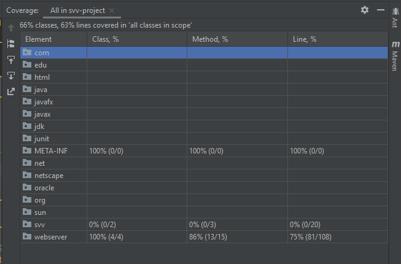
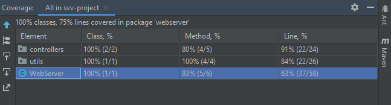

#SPOTBUGS INCLUDES

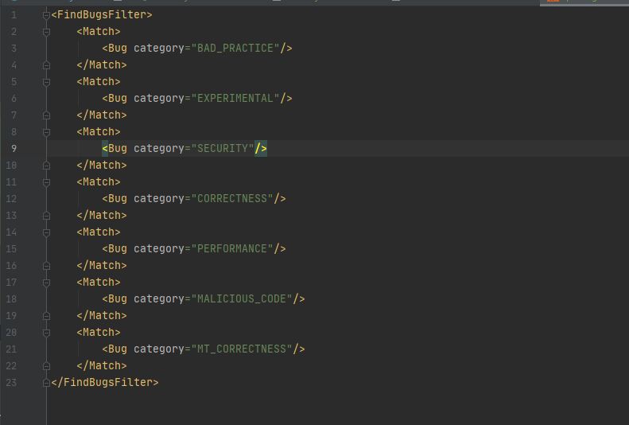

#STATIC ANALYSIS - SPOTBUGS

invokesSystemExit.PNG)
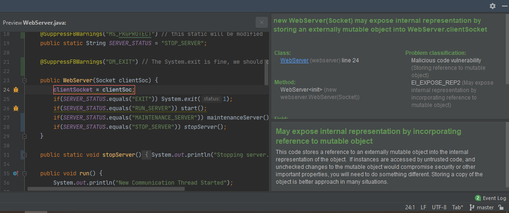
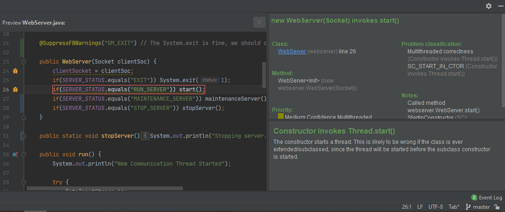
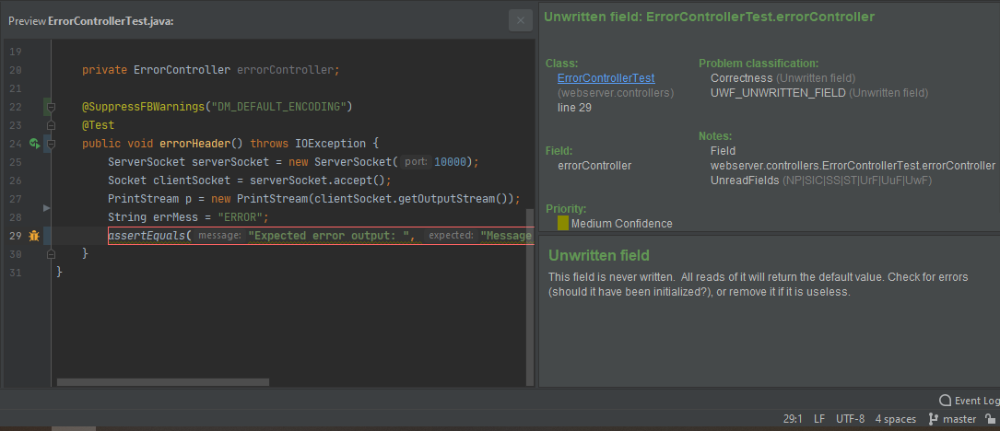
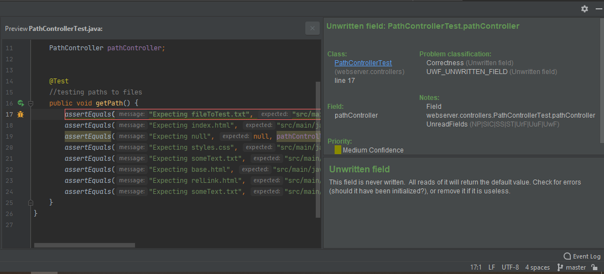
invokesRunOnThread.PNG)
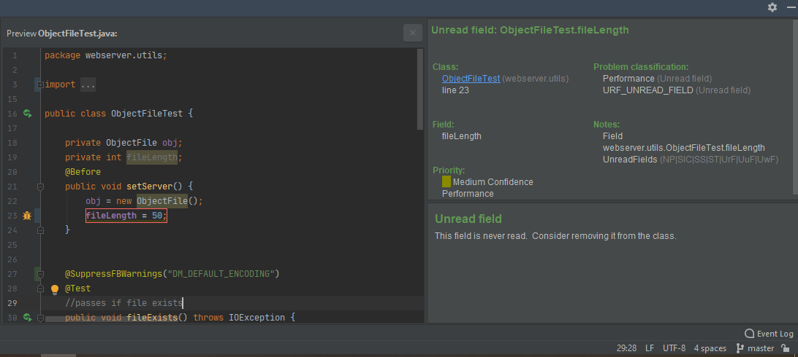

#DYNAMIC ANALYSIS - YOURKIT

.png)
.png)
.png)
.png)
.png)

#3DView

* base - maintenence state
* 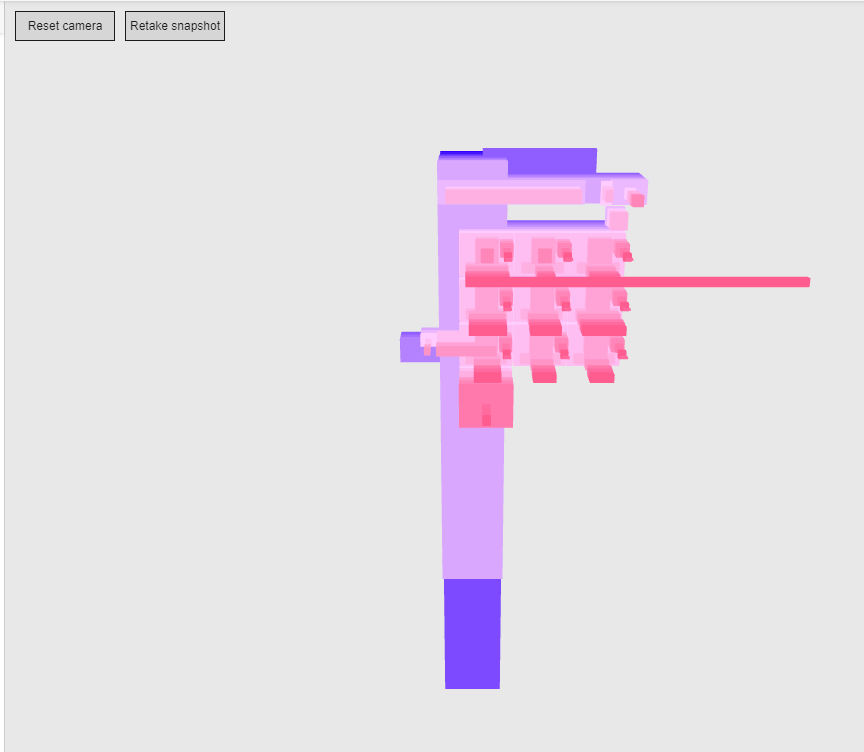
* base - run state
* 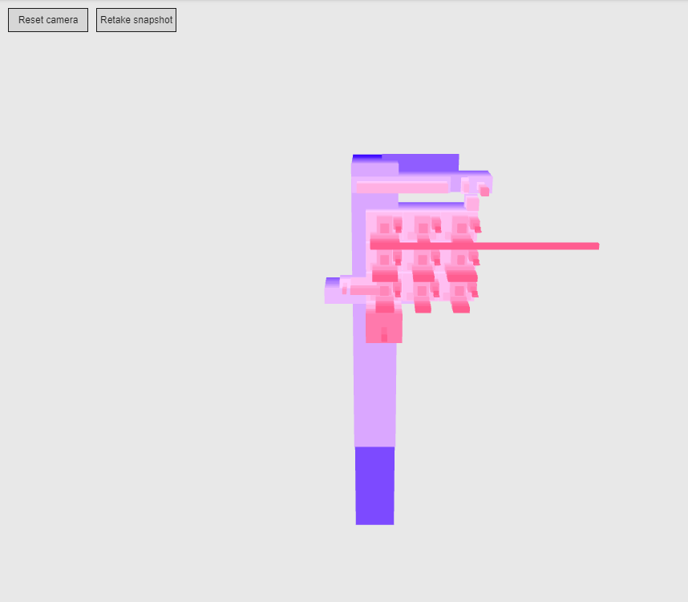
* index - run state
* 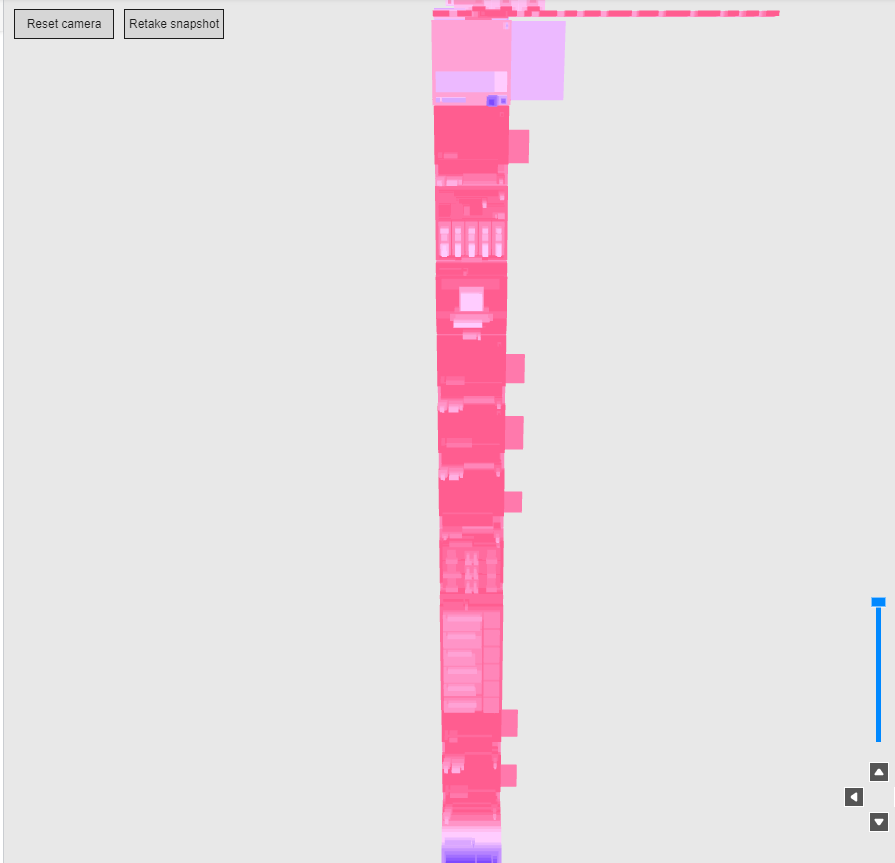

#MARATHON

* error
* 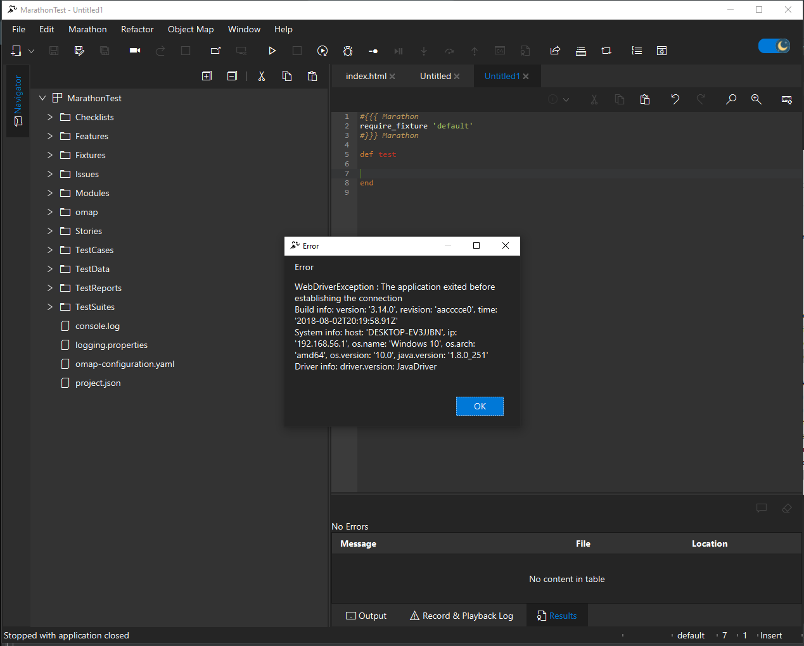
* folder
* 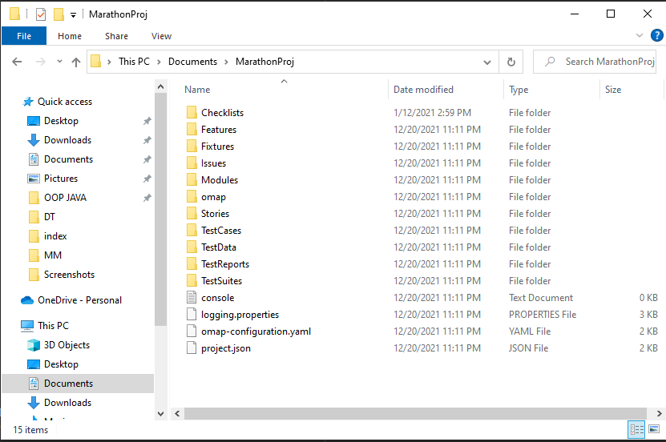
